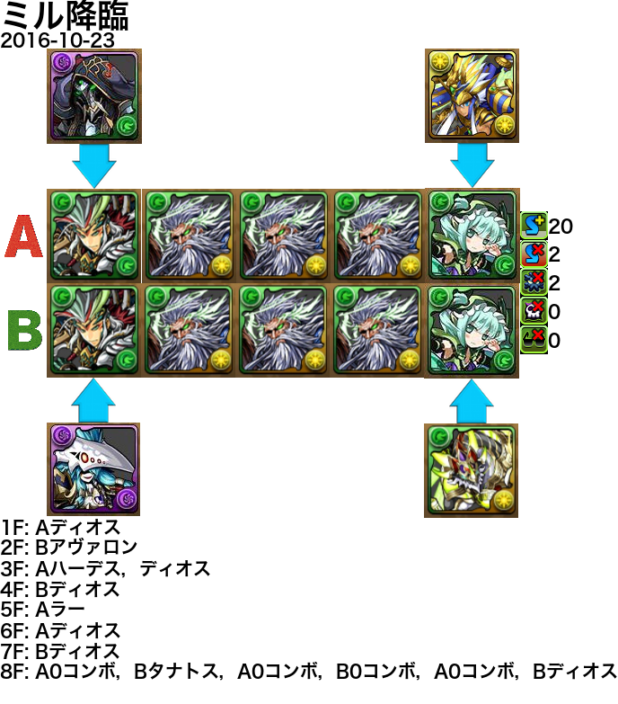

# PadPT
PadPT generates a walkthrough sheet for Puzzle & Dragons from a text file.

## LICENSE
MIT

## Input
Input text files follow the below format.

    <title>

    <party>

    <party>

    <note>

Here,

    <title> ::= (<namechar>|,)*
    <party> ::= <member>{0,5}
    <member> ::= (<monster>|<monster>,<monster>)\n
    <monster> ::= <namechar>+
    <namechar> ::= <any character except \n or ,>
    <note> ::= <any string>

|Element                |Mean                                              |
|:----------------------|:-------------------------------------------------|
|title                  |title (e.g., dungeon name)                        |
|former party           |party A                                           |
|later party            |party B                                           |
|note                   |walkthrough                                       |
|member                 |monster name and assist monster name if any       |

For example,

    ミル降臨

    覚醒劉備,覚醒ハーデス
    ディオス
    ディオス
    ディオス
    木アスタロト,光ラー

    覚醒劉備,タナトス
    ディオス
    ディオス
    ディオス
    木アスタロト,アヴァロン

    1F: Aディオス
    2F: Bアヴァロン
    3F: Aハーデス，ディオス
    4F: Bディオス
    5F: Aラー
    6F: Aディオス
    7F: Bディオス
    8F: A0コンボ，Bタナトス，A0コンボ，B0コンボ，A0コンボ，Bディオス

If you want to generate a sheet for solo, you can write as folllows:

    金曜ダンジョン（超地獄）

    ヤマトタケル
    ハンジ
    赤オーディン
    赤オーディン
    五右衛門

    ヤマトタケル

    1F: ハンジ，赤オーディン
    2F: 赤オーディン
    3F: 五右衛門
    4F: 崩す

## Output
Output files are png format.
Output files have the following information:
* Title
* Timestamp (automatically)
* Monster icons of party A
* Monster icons of party B
* The numbers of awoken skills
 * Skill boost
 * Resistance-skill lock
 * Resistance-jammers
 * Resistance-poison
 * Resistance-dark
* Note/Walkthrough

For example, PadPT outputs the following sheet from the first input example:

## Dependencies
* Python 3.5.2
* Pillow 3.3.0

## Config
You can configure the following items by editing files in ~/.padpt/:
* Monster name alias
* Font
* Database URL for update

Note: config files must be encoded in UTF-8.

### Monster Name Alias
You can configure monster name alias by editing ~/.padpt/alias.csv.
Records in the csv follow the below format:

    <monster>,<natural number that may be suppressed 0>

For example,

    覚醒劉備,2903
    ディオス,2948
    タナトス,0923

Note that there must not exist two or more than records
that have the same monster name (the first element).
The natural number (the second element) is the monster number.
The number must be consistent with database.

### Others
You can configure font in output sheets, database URL for update
by editing ~/.padpt/padpt.conf.
The conf file follows the below format:

    [PadPT]
    Font=<path>
    DB_URL=<URL>

DB_URL must satisfy the following two conditions:

* *DB_URL*/monsters.csv is a csv file
* For any recored in *DB_URL*/monsters.csv, let *i* be the first element.
Then, *DB_URL*/icons/*i*.jpg is a jpg file

Records in *DB_URL*/monsters.csv follows the below format:

    monster_id,skill_boost,skill_lock,jammers,poison,dark
    <natural number that may be suppressed 0>,<non-negative integer>{5,5}

An example of conf/padpt.conf is shown below,

    [PadPT]
    Font=/System/Library/Fonts/ヒラギノ角ゴ ProN W6.otf
    DB_URL=http://www.foo.jp/padpt

## Script Usage
### Output a Sheet
Let *x* be an input text file and *y* be an output png file. Then,

    padpt x y

### Update Database

    padpt -u

You can specify the update option, input file, and output file.
So the following usage is right where *x* is an input text file and
*y* be an output png file.

    padpt -u x y

## Note
PadPT has no connections with Puzzle & Dragons and GungHo Online Entertainment.
